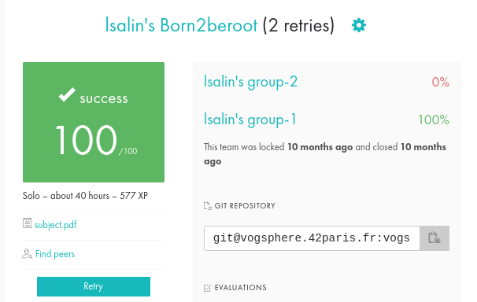

# Born2beRoot

🇺🇸

The Born2beRoot project is an introduction to virtualization with a focus on system administration.  
The goal of the project is to configure a Debian virtual machine with VirtualBox.

__Many concepts have been covered during this project__:

* Disk partitioning and LVM.
* Configuration of a firewall (UFW).
* SSH protocol configuration.
* The importance of securing a system with sudo.
* Setup a strict password policy.
* Implementation of a monitoring script.

🇫🇷

Le projet Born2beRoot est une introduction à la virtualisation mettant l'accent sur l'administration système.  
Le but du projet est de configurer une machine virtuelle Debian avec VirtualBox.

__De nombreuses notions ont été abordées pendant ce projet__ :

* Partitionnement des disques et LVM.
* Configuration d'un pare-feu (UFW).
* Configuration du protocole SSH.
* L'importance de la sécurisation d'un système grâce à sudo.
* Configuration d'une politique de mot de passe stricte.
* Mise en place d'un script de surveillance.

